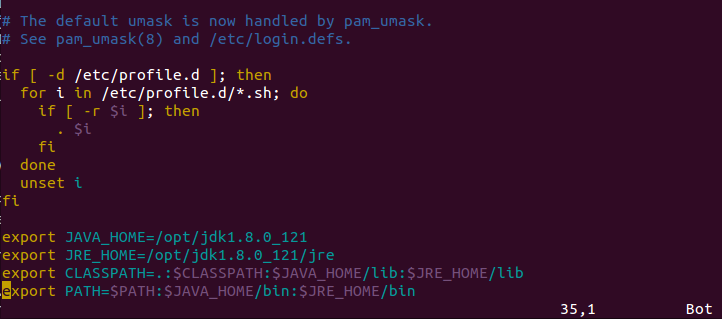
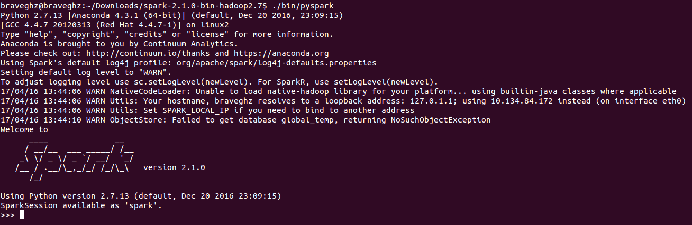
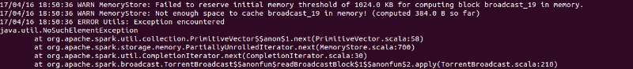

# spark学习

##spark配置

需要的环境：`java` + `python`

### ubuntu配java

查看自己电脑是有否`java`

```py
$ java -version
```
没有的话继续往下，安装。[java jdk下载](http://www.oracle.com/technetwork/java/javase/downloads/index.html)

解压
```py
cd Downloads/
tar -zxvf jdk-8u121-linux-x64.tar.gz
```

得到 `jdk1.8.0_121`,我把`jdk`文件夹放到`opt`了
```py
sudo cp -r /home/braveghz/Downloads/jdk1.8.0_121 /opt
```

配置
```
vim /etc/profile
```

最后加四行
```py
export JAVA_HOME=/opt/jdk1.8.0_121
export JRE_HOME=/opt/jdk1.8.0_121/jre
export CLASSPATH=.:$CLASSPATH:$JAVA_HOME/lib:$JRE_HOME/lib
export PATH=$PATH:$JAVA_HOME/bin:$JRE_HOME/bin
```

第1、2行写你自己的路径，3、4行不变,如下图



ok,使配置生效

```
source /etc/profile
```

ok,查看是否成功哦
```py
braveghz@braveghz:~/Downloads$ java -version
java version "1.8.0_121"
Java(TM) SE Runtime Environment (build 1.8.0_121-b13)
Java HotSpot(TM) 64-Bit Server VM (build 25.121-b13, mixed mode)
```

### ubuntu python 配置
这个我配好了===

### 搭建hadoop的环境

---

## spark开始

下载spark [Spark下载页](http://spark.apache.org/downloads.html) 

然后解压运行

```py
cd Downloads
tar -xf spark-2.1.0-bin-hadoop2.7.tgz
cd spark-2.1.0-bin-hadoop2.7.tgz
```

打开`python`版本的`Spark shell`

```
./bin/pyspark
```
如下图




打开`Scala`版本的`shell`

```
./bin/spark-shell
....
....
....

Welcome to
      ____              __
     / __/__  ___ _____/ /__
    _\ \/ _ \/ _ `/ __/  '_/
   /___/ .__/\_,_/_/ /_/\_\   version 2.1.0
      /_/
         
Using Scala version 2.11.8 (Java HotSpot(TM) 64-Bit Server VM, Java 1.8.0_121)
Type in expressions to have them evaluated.
Type :help for more information.

scala> 

```

---

在`Spark`中，我们通过对分布式数据集的操作来表达我们的计算意图，这些计算会自动的在集群上并行进行。这样的数据集被称为弹性分布式数据集(`resilient distributed dataset`),简称`RDD`。`RDD`是对分布式数据和计算的基本抽象。

简单例子，我们使用本地文本文件创建一个`RDD`来作一些简单的即时统计。

>python行数统计

```py
>>> lines = sc.textFile("README.md") #创建一个名为lines的RDD
>>> lines.count() #统计RDD中的元素个数
104
>>> lines.first() #这个RDD中的第一个元素，也就是README.md中的第一行
u'# Apache Spark'
>>> 

```

> Scala行数统计
```s
scala> val lines = sc.textFile("README.md")
lines: org.apache.spark.rdd.RDD[String] = README.md MapPartitionsRDD[1] at textFile at <console>:24

scala> lines.count()
res0: Long = 104

scala> lines.first()
res1: String = # Apache Spark

```
退出`shell` 按 `Ctrl+D`

----

## 基于K均值聚类的网络流量异常检测

**------------------------------------《Spark高级数据分析》第5章**

**分类和回归技术**

使用分类器来预测未知值：为了预测新数据的未知值，必须事先给定许多样本并且样本的目标值已知。所以分类器，在我们知道我们要找什么并且可以提供大量包含输入及正确输出的样本数据的情况下才发挥作用。由于在学习过程中，对每个输入样本都给出正确的输出值作指导，所以分类和回归技术都属于监督学习技术。

然鹅，在样本仅能给出部分的正确输出或者不能给出输出时，分类和回归技术就不能用。

所以，就到了非监督学习技术。
目标值是未知的，所以非监督学习技术不会学习如何预测目标值。但是，他可以学习数据的结构并且找出相似输入的群组，或者学习哪些输入类型可能出现，哪些输入类型不可能出现。

### 异常检测

如果已经知道“异常”代表什么，那么就可以用监督学习来预测出数据集中的异常。（样本标记为‘正常’和‘异常’，算法通过学习样本来区分‘正常’和‘异常’）
异常检测，常用于检测欺诈、网络攻击、服务器及传感设备故障。在这些异常中，我们经常需要检测出新的异常，比如新的欺诈方法啊新的攻击方式啊新的服务器故障模式啊....
非监督学习---知道什么是正常输入，然后找出跟历史输入不同的‘异常’的输入，但是也不一定是欺诈、攻击、故障..它们只是异常，需要进一步处理。

### K均值聚类

聚类是最有名的**非监督学习**算法,它试图找到数据中的自然群组。一群**互相相似而与其他点不同的数据点**往往属于**代表某中意义的一个簇群**，聚类算法就是要把这些相似的数据划分到同一簇群中。
K均值聚类，是应用最广泛的聚类算法。它试图在数据集中找出K个簇群，这里的k值自己定。k是模型的超参数，其最优值与数据集本身有关。事实上，一个关键点就是如何选择合适的k值。
对数据集来说，什么是相似？--k均值算法中数据点相互距离一般采用欧式距离。

### 网络入侵

有些入侵的模式是已知的，比如说连续不断访问某个机器的所有端口，正常的软件程序是不会这样做的，这往往是攻击的第一步，找到计算机上有哪些可能被攻破的服务。
统计对各个端口在短时间内被远程访问的次数，可以得到一个特征，该特征可以很好的预测端口攻击。如果访问的次数不多，那可能就是正常情况，如果短时间内被访问了上百次，那么就可能是攻击行为了。
这种方法也适用于 **其他从网络连接特征中预测网络攻击**，这些特征包括 发送和接收的字节数，tcp错误数等.

最大的威胁，可能是，从未被识别和分类的情况。检测潜在的网络入侵就是要识别这些异常，我们并不知道这异常是不是攻击，但是他们和以前的连接都不一样

我们利用K均值之类的非监督学习技术来识别网络异常连接。**K均值可以根据每个网络连接的统计属性进行聚类。从个体上看簇群是没有意义的，但是从整体上看啊，结果簇群定义了历史连接的类型。因此簇群帮我们界定了正常连接的区域，任何在区域之外的点都是不正常的，也就是异常情况。**

### KDD Cup1999数据集
[KDD Cup1999数据集](http://kdd.ics.uci.edu/databases/kddcup99/kddcup99.html) 下载kddcup.data.gz，不大，好像17M多一点

下载下来了可以打开看看

数据是原始网络流量包加工之后的，是每个网络连接的统计信息。数据集大约708M，490w个连接。数据集中每个连接的信息包括发送的字节数、收到的字节数、登陆次数、tcp错误次数等，csv格式，每个连接一行，38个特征。

许多特征值为0或1,表示某种行为是否出现。还有一些特征代表比率，比如说取值范围[0.0,1.0]。

最后一列为类型标号，大多数标号为`normal`,但是也有一些样本代表网络攻击。我们这里讨论异常检测问题，所以算法中不用这些标号信息。


### 初步尝试聚类

目前全是`scala`实现
```s
scala> val rawData = sc.textFile("/home/braveghz/MachineLearning-python/spark/kddcup.data.corrected")
rawData: org.apache.spark.rdd.RDD[String] = /home/braveghz/MachineLearning-python/spark/kddcup.data.corrected MapPartitionsRDD[8] at textFile at <console>:24

scala> rawData.count()
res5: Long = 4898431                                                            

scala> rawData.map(_.split(',').last).countByValue().toSeq.sortBy(_._2).reverse.foreach(println) #分类统计样本个数，按照样本个数从多到少排序，打印结果
(00,smurf,2807886)                                                              
(00,neptune,1072017)
(00,normal,909809)
(01,normal,16872)
(00,satan,15885)
(00,ipsweep,12437)
(00,portsweep,10287)
(02,normal,4794)
(98,normal,3182)
(99,normal,2958)
(03,normal,2632)
(04,normal,2525)
(00,nmap,2316)
(05,normal,1832)
(97,normal,1451)
(06,normal,1181)
(00,warezclient,1010)
(95,normal,982)
(00,teardrop,979)
(96,normal,976)
(94,normal,943)
(07,normal,892)
(93,normal,885)
(89,normal,808)
(80,normal,723)
(78,normal,679)
(91,normal,649)
(74,normal,648)
(05,back,592)
(04,back,577)
(87,normal,560)
(85,normal,554)
(84,normal,522)
(75,normal,516)
(92,normal,513)
(82,normal,501)
(67,normal,498)
(90,normal,462)
(68,normal,409)
(79,normal,404)
(08,normal,390)
(83,normal,375)
(53,normal,369)
(86,normal,367)
(66,normal,341)
(88,normal,338)
(56,normal,330)
(72,normal,330)
(69,normal,324)
(76,normal,320)
(55,normal,319)
(60,normal,308)
(02,back,293)
(62,normal,290)
(77,normal,286)
(58,normal,284)
(71,normal,280)
(65,normal,273)
(33,normal,271)
(57,normal,267)
(00,pod,264)
(54,normal,261)
(81,normal,250)
(64,normal,249)
(03,back,247)
(70,normal,246)
(40,normal,236)
(09,normal,230)
(29,normal,227)
(73,normal,226)
(12,normal,224)
(59,normal,206)
(61,normal,189)
(45,normal,181)
(51,normal,180)
(50,normal,171)
(01,back,171)
(52,normal,171)
(35,normal,161)
(13,normal,157)
(63,normal,154)
(42,normal,148)
(49,normal,143)
(34,normal,137)
(38,normal,135)
(06,back,133)
(41,normal,128)
(39,normal,126)
(36,normal,123)
(44,normal,121)
(47,normal,118)
(11,normal,114)
(43,normal,111)
(48,normal,111)
(10,normal,98)
(31,normal,92)
(46,normal,91)
(25,normal,88)
(37,normal,83)
(32,normal,74)
(20,normal,71)
(27,normal,67)
(14,normal,66)
(50,portsweep,66)
(00,back,59)
(17,normal,58)
(24,normal,45)
(30,normal,42)
(28,normal,39)
(15,normal,38)
(22,normal,34)
(33,portsweep,34)
(18,normal,34)
(26,normal,27)
(00,buffer_overflow,25)
(23,normal,23)
(16,normal,22)
(00,land,21)
(00,warezmaster,20)
(50,ipsweep,18)
(19,normal,17)
(21,normal,16)
(00,imap,12)
(95,guess_passwd,12)
(94,guess_passwd,10)
(00,rootkit,9)
(16,back,9)
(01,portsweep,9)
(19,back,9)
(00,ftp_write,8)
(00,loadmodule,8)
(07,back,8)
(15,back,8)
(00,multihop,7)
(02,ipsweep,7)
(96,guess_passwd,7)
(18,back,7)
(08,back,7)
(17,back,6)
(20,back,6)
(93,guess_passwd,6)
(02,warezclient,5)
(02,portsweep,5)
(92,guess_passwd,5)
(10,back,4)
(09,back,4)
(03,ipsweep,4)
(00,phf,4)
(50,back,3)
(11,back,3)
(33,back,3)
(24,back,3)
(38,back,3)
(35,back,3)
(20,portsweep,3)
(67,ipsweep,3)
(21,back,3)
(28,back,3)
(00,perl,3)
(01,ipsweep,3)
(29,back,3)
(31,back,2)
(29,ipsweep,2)
(37,back,2)
(03,portsweep,2)
(22,back,2)
(32,back,2)
(42,back,2)
(10,portsweep,2)
(47,back,2)
(00,spy,2)
(23,back,2)
(00,guess_passwd,2)
(25,back,2)
(14,back,2)
(91,guess_passwd,2)
(12,back,2)
(05,ipsweep,2)
(17,portsweep,2)
(27,back,2)
(26,back,2)
(86,satan,1)
(12,buffer_overflow,1)
(83,guess_passwd,1)
(11,warezclient,1)
(43,back,1)
(90,guess_passwd,1)
(83,back,1)
(95,satan,1)
(10,buffer_overflow,1)
(93,portsweep,1)
(78,satan,1)
(45,back,1)
(39,back,1)
(40,back,1)
(09,warezclient,1)
(82,satan,1)
(89,guess_passwd,1)
(36,back,1)
(01,warezclient,1)
(50,guess_passwd,1)
(25,rootkit,1)
(09,satan,1)
(25,ipsweep,1)
(12,warezclient,1)
(10,loadmodule,1)
(11,buffer_overflow,1)
(10,warezclient,1)
(71,back,1)
(62,back,1)
(01,satan,1)
(14,buffer_overflow,1)
(44,back,1)
(75,guess_passwd,1)
(07,ipsweep,1)
(04,ipsweep,1)
(05,portsweep,1)
(56,back,1)
(86,guess_passwd,1)
(17,buffer_overflow,1)
(67,guess_passwd,1)
(06,ipsweep,1)
(12,portsweep,1)
(13,ipsweep,1)
(88,guess_passwd,1)
(34,back,1)
(30,back,1)
(80,guess_passwd,1)
(90,satan,1)
```

在数据中，有些特征并不是数值类型的，比如第二列可能是`tcp`、`udp`或`icmp`，但是`K均值聚类算法`要求特征为数据型。看一下数据，发现第1,2,3列和最后一列为非数值型，我们先忽略这些非数值型。

以下代码将csv格式的行拆分为列，删除下标从1开始的三个类别型列和最后的标号列。

保留其他值并将其转换成一个数值型（Double型对象）数组，接着把数组和标号组成一个元组。

```s
import org.apache.spark.mllib.linalg._

val labelAndData = rawData.map{line =>
    val buffer = line.split(',').toBuffer #toBuffer创建一个Buffer，它是一个可变列表
    buffer.remove(1,3)
    val label = buffer.remove(buffer.length-1)
    val vector = Vectors.dense(buffer.map(_.toDouble).toArray)
    (label,vector)
    }

val data = labelAndData.values.cache()
```

K均值在运行过程中只用到特征向量（没有用到数据集的目标标号列*（第0列吗？）*），因此data这个RDD只包含元组的第二个元素，可以通过元组类型RDD的values属性得到。

用Spark MLlib对数据进行聚类非常简单，在代码中导入KMeans的实现类并执行即可。代码如下，它先建立了KMeansModel模型然后输出每个簇的质心：

```s
import org.apache.spark.mllib.clustering._

val kmeans = new KMeans()
val model = kmeans.run(data)

model.clusterCenters.foreach(println)
```

实现如下

```s
scala> val labelAndData = rawData.map{line => 
     | val buffer = line.split(',').toBuffer
     | buffer.remove(1,3)
     | val label = buffer.remove(buffer.length-1)
     | val vector = Vectors.dense(buffer.map(_.toDouble).toArray)
     | (label,vector)
     | }
labelAndData: org.apache.spark.rdd.RDD[(String, org.apache.spark.mllib.linalg.Vector)] = MapPartitionsRDD[13] at map at <console>:29

scala> val data = labelAndData.values.cache()
data: org.apache.spark.rdd.RDD[org.apache.spark.mllib.linalg.Vector] = MapPartitionsRDD[14] at values at <console>:31

scala> import org.apache.spark.mllib.clustering._
import org.apache.spark.mllib.clustering._

scala> val kmeans = new KMeans()
kmeans: org.apache.spark.mllib.clustering.KMeans = org.apache.spark.mllib.clustering.KMeans@6581ee8

scala> val model = kmeans.run(data)
....
#这里很多很多很多很多很多多Fail信息。类似这种
#17/04/16 15:53:14 WARN BlockManager: Putting block rdd_14_5 failed
#17/04/16 15:53:14 WARN MemoryStore: Not enough space to cache rdd_14_14 in memory! (computed 40.3 MB so far)
#17/04/16 15:53:14 WARN BlockManager: Block rdd_14_14 could not be removed as it was not found on disk or in memory

scala> model.clusterCenters.foreach(println)
[48.34019491959669,1834.6215497618625,826.2031900016945,5.7161172049003456E-6,6.487793027561892E-4,7.961734678254053E-6,0.012437658596734055,3.205108575604837E-5,0.14352904910348827,0.00808830584493399,6.818511237273984E-5,3.6746467745787934E-5,0.012934960793560386,0.0011887482315762398,7.430952366370449E-5,0.0010211435092468404,0.0,4.082940860643104E-7,8.351655530445469E-4,334.9735084506668,295.26714620807076,0.17797031701994304,0.17803698940272675,0.05766489875327384,0.05772990937912762,0.7898841322627527,0.021179610609915762,0.02826081009629794,232.98107822302248,189.21428335201279,0.753713389800417,0.030710978823818437,0.6050519309247937,0.006464107887632785,0.1780911843182427,0.17788589813471198,0.05792761150001037,0.05765922142400437]
[10999.0,0.0,1.309937401E9,0.0,0.0,0.0,0.0,0.0,0.0,0.0,0.0,0.0,0.0,0.0,0.0,0.0,0.0,0.0,0.0,1.0,1.0,0.0,0.0,1.0,1.0,1.0,0.0,0.0,255.0,1.0,0.0,0.65,1.0,0.0,0.0,0.0,1.0,1.0]

```
书上说：程序输出两个向量，代表K均值将数据聚类成2个簇。
嗯....所以以上那一坨....目前可能看来向是两个...向量===

继续

对于本章的数据集，我们知道连接的类型有23个，因此程序肯定没能准确刻画出数据中的不同的群组。

这时利用给定的类别标号信息，我们直观的看到两个簇中分别包含哪些类型的样本。为此，可以对每个簇中每个标号出现的次数进行计数。利用前面得到的K均值模型，下面的代码先为每个数据点分配一个簇，然后对簇-类别对进行计数，并以可读的方式输出。

```s
scala> val clusterLabelCount = labelAndData.map{case(label,datum)=>
     | val cluster = model.predict(datum)
     | (cluster,label)
     | }.countByValue
clusterLabelCount: scala.collection.Map[(Int, String),Long] = Map((0,portsweep.) -> 10412, (0,rootkit.) -> 10, (0,buffer_overflow.) -> 30, (0,phf.) -> 4, (0,pod.) -> 264, (0,perl.) -> 3, (0,spy.) -> 2, (0,ftp_write.) -> 8, (0,nmap.) -> 2316, (0,ipsweep.) -> 12481, (0,imap.) -> 12, (0,warezmaster.) -> 20, (0,satan.) -> 15892, (0,teardrop.) -> 979, (0,smurf.) -> 2807886, (0,neptune.) -> 1072017, (0,loadmodule.) -> 9, (0,guess_passwd.) -> 53, (0,normal.) -> 972781, (0,land.) -> 21, (0,multihop.) -> 7, (1,portsweep.) -> 1, (0,warezclient.) -> 1020, (0,back.) -> 2203)

scala> clusterLabelCount.toSeq.sorted.foreach{
     | case((cluster,label),count)=>
     | println(f"$cluster%1s$label%18s$count%8s")
     | }
0             back.    2203
0  buffer_overflow.      30
0        ftp_write.       8
0     guess_passwd.      53
0             imap.      12
0          ipsweep.   12481
0             land.      21
0       loadmodule.       9
0         multihop.       7
0          neptune. 1072017
0             nmap.    2316
0           normal.  972781
0             perl.       3
0              phf.       4
0              pod.     264
0        portsweep.   10412
0          rootkit.      10
0            satan.   15892
0            smurf. 2807886
0              spy.       2
0         teardrop.     979
0      warezclient.    1020
0      warezmaster.      20
1        portsweep.       1

```
不过到现在结果应该是还是对的。以上，看到簇1只有一个数据点哦===

### K的选择

显然啊，把数据集分成2个簇是不够的，但是应该分成多少个簇呢？

在这个数据集中有23中不同的入侵模式，因此k至少应该取值23或者更大。通常，我们要尝试多个不同的k来找到最好的k值。但是什么是最好的呢？
如果每个数据点都紧靠最近的质心，则可以认为聚类是较优的。

因此我们定义一个欧式距离函数和一个返回数据点到最近簇质心距离的函数。

```s
scala> def distance(a:Vector,b:Vector)=   #两个向量相应元素的差的平方的和的平方根
     | math.sqrt( a.toArray.zip(b.toArray).map(p=>p._1-p._2).map(d=>d*d).sum  )
distance: (a: org.apache.spark.mllib.linalg.Vector, b: org.apache.spark.mllib.linalg.Vector)Double
#倒过来看这个函数，a.toArray.zip(b.toArray)表示两个向量对应的元素，map(p=>p._1-p._2)表示差，map(d=>d*d)表示平方，sum对应和，sqrt对应平方根


scala> def distToCentroid(datum:Vector, model:KMeansModel)={
     | val cluster = model.predict(datum)
     | val centroid = model.clusterCenters(cluster)
     | distance(centroid, datum)
     | }
distToCentroid: (datum: org.apache.spark.mllib.linalg.Vector, model: org.apache.spark.mllib.clustering.KMeansModel)Double

```

定义好以上两个函数之后，现在来为一个给定k值的模型定义平均质心距离函数：
```s
scala> import org.apache.spark.rdd._
import org.apache.spark.rdd._

scala> def clusteringScore(data:RDD[Vector], k:Int)={
     | val kmeans = new KMeans()
     | kmeans.setK(k)
     | val model = kmeans.run(data)
     | data.map(datum=>distToCentroid(datum,model)).mean()
     | }
clusteringScore: (data: org.apache.spark.rdd.RDD[org.apache.spark.mllib.linalg.Vector], k: Int)Double
```

现在我们用上述方法对k的取值进行评价，比如从5到40,代码如下
```s
scala> (5 to 40 by 5).map(k=>(k,clusteringScore(data,k))).foreach(println)
#scala 采用(5 to 40 by 5) 来建立一个数字集合，集合元素为闭合区间的等差数列

17/04/16 16:36:45 WARN MemoryStore: Not enough space to cache rdd_14_0 in memory! (computed 17.9 MB so far)
17/04/16 16:36:45 WARN BlockManager: Block rdd_14_0 could not be removed as it was not found on disk or in memory
17/04/16 16:36:45 WARN BlockManager: Putting block rdd_14_0 failed
17/04/16 16:36:45 WARN MemoryStore: Not enough space to cache rdd_14_2 in memory! (computed 17.9 MB so far)
17/04/16 16:36:45 WARN BlockManager: Block rdd_14_2 could not be removed as it was not found on disk or in memory
17/04/16 16:36:45 WARN BlockManager: Putting block rdd_14_2 failed
[Stage 19:=========>                                               (4 + 8) / 23]
17/04/16 16:36:45 WARN MemoryStore: Not enough space to cache rdd_14_6 in memory! (computed 11.8 MB so far)
17/04/16 16:36:45 WARN BlockManager: Block rdd_14_6 could not be removed as it was not found on disk or in memory
17/04/16 16:36:45 WARN BlockManager: Putting block rdd_14_6 failed
17/04/16 16:36:45 WARN MemoryStore: Not enough space to cache rdd_14_1 in memory! (computed 17.9 MB so far)
17/04/16 16:36:45 WARN BlockManager: Block rdd_14_1 could not be removed as it was not found on disk or in memory
17/04/16 16:36:45 WARN BlockManager: Putting block rdd_14_1 failed
```

报错了
```s
Caused by: java.util.NoSuchElementException
```
迭代器错误？？



我改成了数组访问也不对哦
```s
scala> var kArray = new Array[Int](2)
scala> kArray(0) = 5;kArray(1) = 10
scala> kArray
res27: Array[Int] = Array(5, 10)
scala> kArray.map(k=>(k,clusteringScore(data,k))).foreach(println)
```

====

经过寻求大腿的帮助@HT liu ,大腿说`spark`的默认运行内存是1G==应该是内存开的太小了
```s
./bin/spark-shell --driver-memory 2g --executor-memory 4g --executor-cores 2
```
也可以更改默认配置，在`spark/conf/spark-conf `貌似是这个配置文件,或者每次都手动指定===我咋没找到？

代码跑了将近20min，终于有结果了===
```s
(5,1938.8583418059204)                                                          
(10,1621.5032064162551)
(15,1468.5011078549371)
(20,1372.4411062475322)
(25,1383.7848028521405)
(30,1294.584624587976)
(35,1493.5959811665393)
(40,1446.817604904851)
```

看结果，得分（即平均到质心的距离）随着k的增加而降低

随着簇的增加，数据距离质心的距离会减小。实际上，如果k=数据点的个数，此时呢每个点都是自己构成的簇的质心，所以此时的平均距离为0.

Whats' worse,前面的结果中k=35时的距离居然比k=30时还大，这不应该发生，因为k取更大值时聚类的结果应该至少与k取得一个较小的值时的结果一样好====（好有道理

问题的原因在于，这种给定k值的K均值算法并不一定得到最优聚类，K均值的迭代过程是一个从一个随机点开始的，因此可能收敛于一个局部最小值，这个局部最小值可能还不错，但并不是全局最优的。

即使采用更智能的方法来选择初始质心，上述情况依然会存在。

“K均值++”和“K均值||”是K均值算法的变体，其初始质心算法更容易产生多种多样且相对分散的初始质心，因为更容易得到较好的聚类结果。实际上`Spark MLlib`实现的就是“K均值||”算法。但是，不管怎么样这里还是有随机选择的因素，所以不能保证全局最优。

K=35和K=40时得分反而增加了，这可能是随机初始质心造成的，也可能是由于算法在达到局部最优之前就过早结束了。为了改善聚类结果，可以采取多次聚类的方法。通过对给定的k值进行多次聚类，每次选择不同的随机初始质心，然后从多次聚类结果中选择最优的。算法提供了`setRuns()`方法，我们可以通过它来设置在给定k值时的运行次数。

增加迭代时间可以优化聚类结果。算法提供了`setEpsilon()`来设置一个阈值，该阈值控制聚类过程中簇质心进行有效移动的最小值。降低该阈值能使质心继续移动更长的时间。

我们再次运行这个实验，但这次k取值更大，从30到300.在下面的示例代码中30-300这个范围用到了`Scala的`并行集合`parallel collection`。这样对每个k值的聚类计算可以在`spark shell`中并行执行。`Spark`会对所有聚类计算任务进行统一管理。当然每个k对应的并行计算都是在集群上分布的执行的，这就是并行内部的并行

===充分利用大规模集群的处理能力，这种做法能提高集群的总体吞吐率。当然，这里有一个临界点，同时提交的任务数超过临界点后吞吐率反而会下降。

```s
scala> import org.apache.spark.rdd._
import org.apache.spark.rdd._
scala> def clusteringScore(data:RDD[Vector], k:Int)={
     | val kmeans = new KMeans()
     | kmeans.setK(k)
     | kmeans.setRuns(10)
     | kmeans.setEpsilon(1.0e-6)
     | val model = kmeans.run(data)
     | data.map(datum=>distToCentroid(datum,model)).mean()
     | }
warning: there was one deprecation warning; re-run with -deprecation for details
clusteringScore: (data: org.apache.spark.rdd.RDD[org.apache.spark.mllib.linalg.Vector], k: Int)Double
```
不知道这样行不行 有warning====要跑很久很久很久

结果
```s
(30,1361.6990147522042)                                                         
(40,1356.300273131501)
(50,1432.1598900207011)
(60,1255.0040744324624)
(70,1130.07802527977)
(80,1043.7544010009885)
(90,982.2760367847161)
(100,1025.2503702992035)
```

书上说，我们要找到一个k的临界点，过了这个临界点后继续增加k值并不会显著的降低得分，这个点就是k值-得分曲线的拐点。这条曲线通常在拐点之后会继续下行但最终趋于水平。====

**我觉得我还没找到**

**如何寻找k值是个问题**

===有个小问题是

我重新定义了这个函数，那么我后面调用的函数是第二个版本吗？
**写个小函数测试一下**
```s
scala> def test()=println("version1")
test: ()Unit

scala> test()
version1

scala> def test()=println("version2")
test: ()Unit

scala> test()
version2
```
这样应该，算是测试了吧。

重新定义函数那么会执行第二个版本。

### 基于R的可视化

`park`本身没有提供可视化的工具，我们用基于`R`的数据集可视化

`R`可以绘制二维或三维空间中的点，但本章的的数据集维度为38（数据集包含38个特征），因此需要把数据集投影到不超过三维的空间上，（这个因果关系在哪里？--）

R不适合处理大型数据集，本实验数据集对R来说太大了，还要进行数据集采样。

开始我们用`k=100`构造一个模型，并把每个数据点都映射到一个簇编号。将特征向量以`csv`格式写到`hdfs`上(书上是k=100)

```s
val sample = data.map(datum=>  #选取了5%的行
    model.predict(datum)+","+datum.toArray.mkString(",")).sample(false, 0.05) #mkString用分隔符把集合元素连接成字符串
scala> sample.saveAsTextFile("/home/braveghz/MachineLearning-python/spark/sample")
```

ok，sample文件夹不需要自己另外创建，执行之后长这样
```s
braveghz@braveghz:~/MachineLearning-python/spark$ cd sample/
braveghz@braveghz:~/MachineLearning-python/spark/sample$ ls
part-00000  part-00004  part-00008  part-00012  part-00016  part-00020
part-00001  part-00005  part-00009  part-00013  part-00017  part-00021
part-00002  part-00006  part-00010  part-00014  part-00018  part-00022
part-00003  part-00007  part-00011  part-00015  part-00019  _SUCCESS
```

下列R代码读入csv数据
```r
install.packages("rgl")
library(rgl)
cluster_data <- read.csv(/home/braveghz/MachineLearning-python/spark/sample/*) ##这样不行
# 书上是用hdfs读取簇和数据
# 但是我看了一下scala读取cvs文件的话 
#   1.csv没有换行符的话可以用textFile()读取并解析数据
#    val input = sc.textFile(inputFile)
#    val result = input.map{line =>
#        val reader = new CSVReader(new StringReader(line));
#        reader.readNext();
#    }
#    2.完整读取CSV（示例）
#    case class Person(name:String, favoriteAnimal:String)
#    val input = sc.wholeTextFile(inputfile)
#    val result = input.flatMap{case(_,txt)=>
#        val reader = new CSVReader(new StringReader(txt));
#        reader.readAll.map(x=>Person(x(0),x(1)))
#        }

```
这一块先跳过吧。

`hadoop`环境有时间再搞。[hadoop环境搭建示例](http://www.cnblogs.com/kinglau/p/3794433.html)


### 特征的规范化

特征的规范化可以通过将每个特征转换为标准得分来完成，也就是说，对每个特征值求平均，用每个特征值减去平均值，然后除以特征值的标准差

标准得分`normalized = (feature - 均值 ) / 方差`

减去均值 相当于把所有数据点沿着相同方向移动相同距离，不影响点之间的欧式距离，所以实际上减去均值对聚类结果并没有影响。

`reduce` 两个数组对应元素想加 `fold` 把平方和汇总到一个初值为0的数组中
```s
val dataAsArray = data.map(_.toArray)
val numCols = dataAsArray.first().length
val n = dataAsArray.count()
val sums = dataAsArray.reduce(
    (a,b)=>a.zip(b).map(t=>t._1+t._2))
val sumSquares = dataAsArray.fold(
    new Array[Double](numCols)
  )(
      (a,b)=>a.zip(b).map(t=>t._1+t._2*t._2)
    )
val stdevs = sumSquares.zip(sums).map{
    case(sumSq,sum) => math.sqrt(n*sumSq-sum*sum)/n
    }
val means = sums.map(_/n)
def normalize(datum:Vector)={
    val normalizedArray = (datum.toArray,means,stdevs).zipped.map(
        (value,mean,stdev)=>
          if(stdev<=0) (value-mean) else (value-mean)/stdev
    ) 
    Vectors.dense(normalizedArray)
}
```

增加k的取值范围并在规范化的数据上运行相同的测试
```s
val normalizedData = data.map(normalize).cache()
(60 to 120 by 10).par.map(k=>(k,clusteringScore(normalizedData,k))).toList.foreach(println)
```


### 类别型变量

前面几节MLlib中KMeans不能用非数值型变量，所以我们把三个类别型变量排除了。

类别型变量可以用 one-hot 编码转换为二元特征。比如说，数据集第二列是协议类型，可能是`tcp`/`udp`/`icmp`，我们可以看作是三个特征 `is_tcp`,`is_udp`,`is_icmp`。这样`tcp`对应`1,0,0`,`udp`对应`0,1,0`,`icmp`对应`0,0,1`。

数据集经过编码所占的空间会增加，我们重新对其进行规范化和聚类。

基于one-hot编码实现类别型变量替换逻辑，见github


### 利用标号的熵信息


### 实战

**以及用python实现本章的代码**


